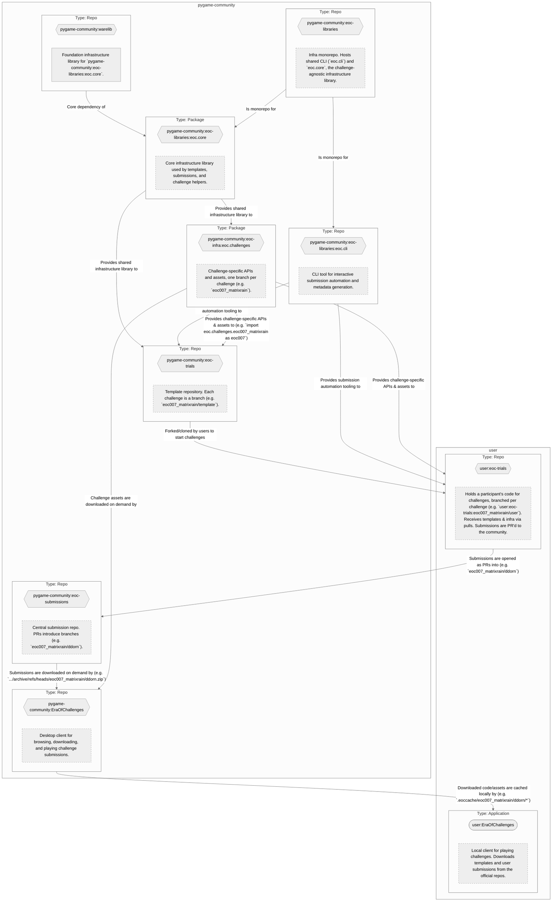

# Era of Challenges – Weekly Challenges Rebooted

NOTE: I use colons as a delimiter between GH users and one of ther repositories, e.g. `ddorn:eoc-trials`.

This proposal separates WeeklyChallenges ( <https://github.com/pygame-community/LegacyWeeklyChallenges> ) into 5 separate repositories and rebrands it as Era of Challenges ( <https://github.com/pygame-community/EraOfChallenges> ).

## 1. Infrastructure

### Delegating the "development repository" responsibilty

`pygame-community:LegacyWeeklyChallenges` should no longer be the repository to fork to participate in era of challenges.

Instead, a new GitHub repository should be created called `pygame-community:eoc-trials`. This allows people to simply instantiate a repository for participating in EOC by forking it, which would come preconfigured with everything needed to work on specific challenges. As time passes, participants will be able to join new challenges by fetching new branches for those challenges. EOC challenge branches would be of the form `eoc<XXX>_<challenge_name>/template`  (`XXX` will be a three digit number with leading zeros if necessary, and can be continually expanded to more digits as needed), e.g. `eoc007_matrixrain/template`. These templates would be provided by challenge creators.

To start working on a challenge inside a `<username>:eoc-trials` fork (e.g. `ddorn:eoc-trials`), a user would need to fetch the newest template branches from `eoc-trials`, e.g. `git fetch upstream`  (`upstream` is `pygame-community:eoc-trials`, while `origin` would be the fork of the form `<username>:eoc-trials`). They would then check-out their target template branch and make a new branch from it to work with, e.g.:

```sh
git remote add upstream "https://github.com/pygame-community/eoc-trials.git" 
git fetch upstream
git switch eoc007_matrixrain/template
git switch --create eoc007_matrixrain/ddorn # will create a new branch based on the current one and switch to it
```

The steps above can be implemented in a CLI too, in the form of `python -m eoc.cli init 006` (prepare challenge 006 locally).

The overall structure for a template branch would be as follows:

```txt
 /
  ┣ eoc-trials/ # the source code folder (mandatory)
  ┃  ┣ __init__.py # The only permitted entry point
  ┃  ┣ ...
  ┣ trial.json
  ┣ pyproject.toml
  ┗ README.md             # contains challenge instructions
```

### Delegating the "submission repository" responsibilty

`pygame-community:LegacyWeeklyChallenges` should no longer be the repository to use for challenge submissions.

Instead, submission should occur by opening PRs to `pygame-community:eoc-submissions` from a fork of the form `<username>:eoc-trials`, tagged with their challenge number as a label and submitted in a timely manner. Submissions would introduce branches of the form `eoc<xxx>_<challenge_name>/<username>` (e.g. `eoc007_matrixrain/ddorn`)  into the `eoc-submissions` repository.

### Delegating the "Era of Challenges Library" responsibilty

`pygame-community:LegacyWeeklyChallenges` should no longer be the repository that contains `wclib`.  Instead, 2 new repositories should be created called [`pygame-community:eoc.core`](https://github.com/pygame-community/eoc) and [`pygame-community:eoc-infra`](https://github.com/pygame-community/eoc-infra). The former will be a repository containing a helper CLI tool for testing and submission, as well as challenge-agnostic infrastructure called `eoc.core`, while the latter will be a [`uv`](https://docs.astral.sh/uv/) monorepo hosting challenge-specific helper code and assets on a separate branch per challenge.

`eoc.challenges.eoc<XXX>_<challenge_name>` will be a series of [namespace packages](https://packaging.python.org/en/latest/guides/packaging-namespace-packages/), whose contained modules make use of `eoc.core` and host the code and assets for a challenge as they are downloaded by participants from GitHub for their challenge entries (assets like images and audio will be included in the package using proper [`hatch`](https://hatch.pypa.io/1.16/config/build/#pyprojecttoml_7) configuration). Each of those branches would be of the form `eoc<XXX>_<challenge_name>` (challenge identifier and name). Installing them would look like e.g. `pip install eoc[eoc007_matrixrain]`, which install `eoc.core` as well as the matching challenge as `"eoc.challenges.eoc007_matrixrain @ git+https://github.com/pygame-community/eoc-infra@eoc007_matrixrain.git#subdirectory=packages/eoc.challenges.eoc007_matrixrain"`. These strings will be exposed inside template branches of `pygame-community:eoc-trials` in `requirements.txt` files.

Era of Challenges challenge entries should import these editions as follows: `import eoc.challenges.eoc007_matrixrain as eoc007`. `eoc007.assets` would expose constants that map to the assets, e.g. `eoc007.assets.IMG_PLAYER`, `eoc007.assets.SFX_EXPLOSION`, `eoc007.assets.MUSIC_THEME`.

### Delegating the "Era of Challenges Client" responsibilty

`pygame-community:EraOfChallenges` should only act as a "player" for playing Weekly Challenges. To avoid people having to download `pygame-community:eoc-submissions` or anything similar, the program would download challenge files on demand from GitHub (`https://github.com/pygame-community/pygame-ce/archive/refs/heads/eoc007_matrixrain/ddorn.zip`), and keep them around in a locally generated cache of the form `.eoccache/eoc<xxx>_challenge_name/<username>/*` .

To make this work, 3 requirements have to be met:

1. Each challenge-specific branch of `pygame-community:eoc-infra` under `packages/eoc.challenges.eoc<XXX>_<challenge_name>/` must have a `challenge.json` file describing a challenge and what achievements it supports.

2. Each challenge submission branch of a participant (`eoc<XXX>_<challenge_name>/<username>`) will need a top level `trial.json` file containing any important challenge metadata (e.g. submitter usernames). It will be generated by a script (e.g. `python3 -m eoc.cli submit`) that triggers an interactive CLI prompt, asking questions relevant to the needed `trial.json` fields (supported achievements would be looked up inside `eoc<XXX>_<challenge_name>/info`, e.g. via `https://cdn.jsdelivr.net/gh/pygame-community/eoc-infra@eoc007_matrixrain/packages/eoc.challenges.eoc007_matrixrain/challenge.json`), as well as prompting for whether repetitive data should be stored inside of Git's repository-level config data if not already present (stored as `git config --local user.name <username>` / `git config --local user.discord_username <Discord username>`, read as `git config --local --get user.name <username>` / `git config --local --get user.discord_username <discord_username>`).

    An initial `trial.json` could look like this:

    ```jsonc
    {
        "github_username": "...", // (required)
        "discord_username": "...", // (optional)
        "display_name": "...", // A preferred display name (optional)
        "achievements": [
           // achievement field names
        ],
    }
    ```

3. Each challenge must have a corresponding branch in `pygame-community/eoc-submissions` called `eoc<XXX>_<challenge_name>/info`, which itself contains a `submitters.txt` file (queried as `https://cdn.jsdelivr.net/gh/pygame-community/eoc-submissions@eoc007_matrixrain/info/submitters.txt`) listing up GitHub usernames of users who submitted, in order to build links like `https://github.com/pygame-community/eoc-submissions/archive/refs/heads/eoc007_matrixrain/ddorn.zip` to download a user's submission code and `trial.json`, with `eoc<XXX>_<challenge_name>/__init__.py` serving as the entry point for `EraOfChallenges` to load a user's submission as a module at runtime. Challenge-specific code and assets would also be downloaded on demand in a similar fashion as `https://github.com/pygame-community/eoc-infra/archive/refs/heads/eoc007_matrixrain.zip`, to access the contained `eoc.challenges.eoc007_matrixrain` directory. This `submitters.txt` file would be automatically updated by a GitHub Action inside `pygame-community:eoc-submissions` that triggers on every PR merge with branch names matching `eoc<XXX>_<challenge_name>/<username>`, appending the submitter's GitHub username to the file if not already present.

## 2. Application Model

In Pygame Community lore, Era of Challenges represent Apprentices aiming to become legendary Guardians of Hisstellis (formerly called Finistellis the origin realm of pygame snake) by undertaking trials at challenges on otherworldly adventures created by the Event Forgers, to eventually be able to protect Hisstellis from supernatural threats.

EraOfChallenges is a meta-application consisting of 3 parts:

1. Challenges: Modules containing challenge-specific APIs and assets, e.g. `eoc007_matrixrain`.
2. Trials: Modules containing attempts at specific challenges by participants, e.g. `ddorn`'s attempt at `eoc007_matrixrain`.
3. World Runners: Applications that allow running trials of challenges.

In essence, challenges are the game definitions and boilerplate, trials are the game content made by participants from a game template provided by the Event Forgers, and worlds are the game engines that run the game content, also forged by Event Forgers.

(to be continued...)

All in all, these changes would lead to a far more scalable future for Era of Challenges.


